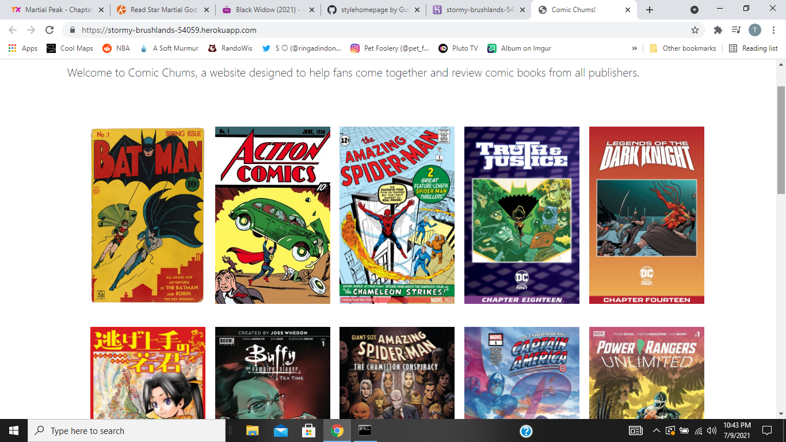

# Comic Chums!

#
# 📝Description 

This app if properly functioning will act as a database for users to share comic books they have read.  Features will include comment section and ratings.

#
## 📝Table of Content
- [Links](#Links)
- [Project Goals](#ProjectGoals)
- [Installation Instructions](#Installation)
- [Technologies Used](#Technologies)
- [Screenshot](#Screenshot)
- [Contact](#Contact)

#
## 🔗 Links

- [Github Repo](https://github.com/thuluong249/comicchum)
- [Heroku](https://dashboard.heroku.com/apps/stormy-brushlands-54059)

#
## 🏆 Project Goals
- User goes to site and sees columns and rows of comic books already in database
- User should be able to click on comic book cover and be taken to another page where comic information is shown
- User can either login or register
- Once logged in, user can rate and comment on comic books in database
- User can add comic books that aren't in database

#
## 📄 Installation

You will need to install all the packages using npm i, beside that you will need to installation of MySql with Workbench to work with this application.

#
## 🔬 Tenchnologies

- [Node.js](https://nodejs.org/en/)
- [npm](https://www.npmjs.com/)
- [Javascript](https://www.javascript.com/)
- [Inquirer]()
- [MySql](https://www.mysql.com/)

#
## 📸 Screenshot 📸

#

#
## ☎️ Contact
If you have any questions, here is a link to contributers github and email addresses.

*👩[Thu Luong](https://github.com/thuluong249)
* <a href="mailto:thujtn2019@gmmail.com">💌 Email</a> 

*👦[Pratik Patel](https://github.com/PratikPatel-Code)
* <a href="mailto:pratikpatel_85@yahoo.com">💌 Email</a> 

*👳‍♂️[Gurjant Riar](https://github.com/GurjantRiar)
* <a href="mailto:gurjant3oct@gmail.com">💌 Email</a> 

*👨[Majelique Lewis](https://github.com/Curry44424)
* <a href="mailto:mlewis4545@aol.com">💌 Email</a>

